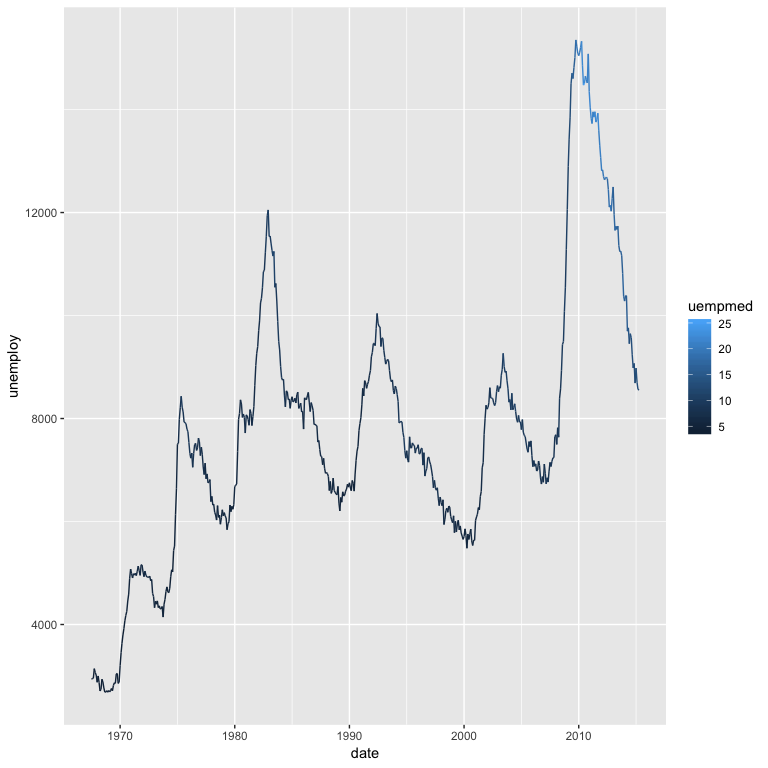
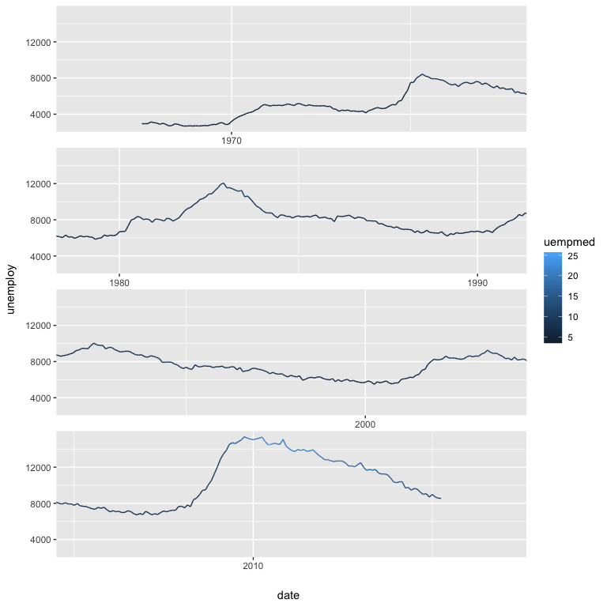

[](https://travis-ci.org/wilkox/ggwrap)
[](https://cran.r-project.org/package=ggwrap)

‘ggwrap’ wraps a ‘ggplot2’ plot over multiple rows, to make plots with
long x axes easier to read.

# Installation

The development version of ‘ggwrap’ can be installed from GitHub:

``` r
devtools::install_github("wilkox/ggwrap")
```

# Usage

The `ggwrap` function takes two arguments: a ‘ggplot2’ plot, and the
number of rows over which the plot should be wrapped.

Here’s a simple plot.

``` r
library(ggplot2)
library(ggwrap)
plot <- ggplot(economics, aes(x = date, y = unemploy, colour = uempmed)) +
  geom_line()
plot
```

<!-- -->

We can use `ggwrap` to wrap the plot over four rows.

``` r
ggwrap(plot, 4)
```

<!-- -->
